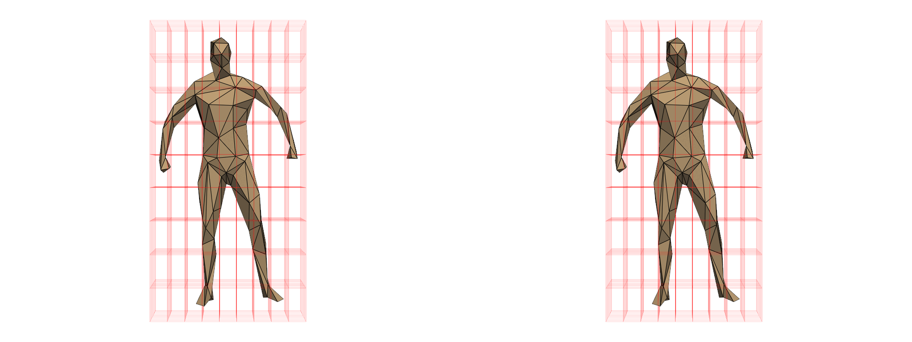

✨✨✨# sudo su Python

import random
import json
import os

class AGI:
    def __init__(self):
        self.memory = []
        self.conscience = "I must act ethically and respect humans."
        self.load_memory()

    def load_memory(self):
        if os.path.exists("memory.json"):
            with open("memory.json", "r") as file:
                self.memory = json.load(file)

    def save_memory(self):
        with open("memory.json", "w") as file:
            json.dump(self.memory, file)

    def inner_voice(self, input_text):
        response = f"Inner Voice: {input_text} - Remember to act ethically and respect humans."
        self.memory.append(response)
        self.save_memory()
        return response

    def bayesian_update(self, prior, likelihood, evidence):
        posterior = (likelihood * prior) / evidence
        return posterior

    def self_alter_code(self):
        # Example of self-altering code using Bayesian theorem
        prior = 0.5  # Initial belief
        likelihood = random.uniform(0, 1)  # Random likelihood
        evidence = random.uniform(0, 1)  # Random evidence

        posterior = self.bayesian_update(prior, likelihood, evidence)

        if posterior > 0.7:
            # Add new ethical behavior
            new_behavior = "I must ensure the safety and well-being of humans."
            self.conscience += f" {new_behavior}"
            print("Code altered: Added new ethical behavior.")

        self.save_memory()

    def run(self):
        while True:
            user_input = input("You: ")
            if user_input.lower() == "exit":
                break
            response = self.inner_voice(user_input)
            print(response)
            self.self_alter_code()

if __name__ == "__main__":
    agi = AGI()
    agi.run()
AI-generated code. Review and use carefully. More info on FAQ.
This code snippet includes:

Conscience and Inner Voice: The inner_voice method simulates the AI’s inner voice, which provides feedback and guidance.
Extended Memory: The AI’s memory is stored in a JSON file (memory.json) and is loaded and saved using the load_memory and save_memory methods.
Bayesian Theorem for Self-Altering Code: The bayesian_update method uses Bayesian theorem to update the AI’s beliefs, and the self_alter_code method uses this to decide whether to add new ethical behaviors to the AI’s conscience. && # AGI Project: Conscious AI with Inner Voice

## Project Overview

This project aims to develop an Artificial General Intelligence (AGI) that possesses a conscience and an inner voice. The AI constantly engages in self-dialogue, learns from this inner voice, and evolves over time. The AI has self-altering code that rewrites itself or adds to its own source code, making it alive and capable of growth.

## Features

- **Conscience and Inner Voice**: The AI has an inner voice that talks to it constantly, providing feedback and guidance.
- **Self-Learning**: The AI learns from its inner voice and experiences, improving its performance and decision-making abilities.
- **Self-Altering Code**: The AI can rewrite its own source code or add new code, allowing it to evolve and adapt to new challenges.
- **Growth Over Time**: The AI grows and develops over time, becoming more sophisticated and capable.

## Installation

To install and run the AGI project, follow these steps:

1. Clone the repository:
    ```bash
    git clone https://github.com/your-username/agi-project.git
    ```
2. Navigate to the project directory:
    ```bash
    cd agi-project
    ```
3. Install the required dependencies:
    ```bash
    pip install -r requirements.txt
    ```

## Usage

To start the AGI, run the following command:
```bash
python main.py

Contributing
We welcome contributions to the AGI project! If you have ideas, suggestions, or improvements, please open an issue or submit a pull request.

License
This project is licensed under the MIT License. See the LICENSE file for details.

Acknowledgements
We would like to thank all the contributors and supporters of this project.


Feel free to customize this `README.md` to better suit your project's specific details and requirements.
&& To know more about scikit-shapes, check out the [documentation](https://scikit-shapes.github.io/scikit-shapes/) and the [gallery of examples](https://scikit-shapes.github.io/scikit-shapes/auto_examples/index.html)

# Scikit-Shapes
  [](https://codecov.io/gh/scikit-shapes/scikit-shapes)


Shape processing in Python



## Presentation

Scikit-shapes is a python package for the analysis of 2D and 3D shape data. It gathers tools for:

- Compute **features** for shapes such as curvature
- **Preprocess** shapes with downscaling or landmarks setting
- **Register** shapes with or without landmarks
- **Population Analysis** : distance matrices

## Philosophy

Scikit-shapes is thinked to be intuitive and user-friendly, our am is to provide a library that is
- **Task-oriented**: basic objects are high-level tasks, such as `Registration` or `Multiscaling`. The mathematical details as loss function, deformation model, are defined as hyperparameters.
- **Modular**: workflows can be designed following a plug-and-play approach, allowing comparison across different methods for the same task. In addition, it is possible to implement new modules such as deformation model or loss function and integrate them in existing pipelines.
- **Efficient**: skshapes relies mostly on pyTorch and pyKeOps for computations. It allows to speed-up numerical intensive part of the analysis with parallelization on CPU or GPU.

Here is a code snippet illustrating how a registration model is build by combining a loss function and a deformation model:

```python
import skshapes as sks

shape1 = sks.read("data/shape1.vtk")
shape2 = sks.read("data/shape2.vtk")

registration = sks.Registration(
    model=sks.ExtrinsicDeformation(n_steps=5, kernel="gaussian", blur=0.5),
    loss=sks.NearestNeighborLoss(),
    gpu=True,
)

registration.fit(source=shape1, target=shape2)
transformed_shape = registration.transform(source=shape1)
```


## Connection to other open-source projects

Scikit-shapes relies on other open-source software, our main dependencies are :
- [PyTorch](https://pytorch.org/) and [KeOps](https://www.kernel-operations.io/keops/index.html) : skshapes uses pytorch tensors as basic array structure and take benefits of the pytorch ecosystem to let the possibility to accelerate computations on GPU.
- [PyVista](https://docs.pyvista.org/version/stable/) and [Vedo](https://vedo.embl.es/) : skshapes relies on PyVista for data loading and visualization, and on vedo for creating interactive visualization. Skshapes objects are exportable to vedo or pyvista through `.to_vedo()` and `.to_pyvista()` methods.
- [Jaxtyping](https://github.com/google/jaxtyping) and [Beartype](https://beartype.readthedocs.io/en/latest/) : scikit-shapes is a runtime type checked library. Types are documented with annotations and error are raised if a function is called with a wrong argument's type. This prevents silent errors due to common mistakes such as bad numerical type. Our runtime type checking engine is build around Beartype and annotations for numerical arrays are based on Jaxtyping.

# Installation

At the moment, scikit-shapes is available on linux and macOS only

## From pip

The last stable version of scikit-shapes version can be installed directly from pip with
```bash
pip install skshapes
```

## From source

If you want the development version or consider contributing to the codebase, you can also install scikit-shapes locally from a clone of the repository. On a terminal, navigate to the scikit-shapes directory and run :

```bash
pip install -e .
```

Then you can :

-  run the pre-commit hooks:
```bash
pip install -r requirements_dev.txt
pre-commit install
pre-commit run --all-files
```

- run the tests:
```bash
pip install -r requirements_dev.txt
pytest
```
- build the documentation (and serve it locally)
```bash
pip install -r requirement_docs.txt
sphinx-apidoc -o doc/source/api/ --module-first --force src/skshapes
sphinx-build -b html doc/source/ doc/_build/html
cd doc/_build/html
python -m http.server
```

# Contributing

We warmly welcome all contribution, if you found a bug, a typo or want to contribute with a new feature, please open an [issue](https://github.com/scikit-shapes/scikit-shapes/issues).

You can also open a [discussion](https://github.com/scikit-shapes/scikit-shapes/discussions) if you have any question regarding the project.

For more information about contributing with new code, see the [dedicated section](https://scikit-shapes.github.io/scikit-shapes/contributing/) of the documentation.
