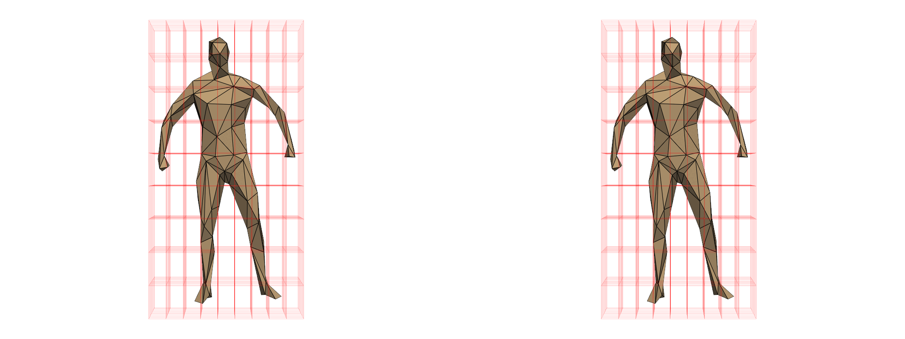

# Scikit-Shapes
Shape processing in Python.



## Presentation

Scikit-shapes is a python package for the analysis of 2D and 3D shape data. It gathers tools for:

- Compute **features** for shapes such as curvature
- **Preprocess** shapes with downscaling or landmarks setting
- **Register** shapes with or without landmarks
- **Population Analysis** : distance matrices

## Philosophy

Scikit-shapes is thinked to be intuitive and user-friendly, our am is to provide a library that is
- **Task-oriented**: basic objects are high-level tasks, such as `Registration` or `Multiscaling`. The mathematical details as loss function, deformation model, are defined as hyperparameters.
- **Modular**: workflows can be designed following a plug-and-play approach, allowing comparison accross different methods for the same task. In addition, it is possible to implement new modules such as deformation model or loss function and integrate them in existing pipelines.
- **Efficient**: skshapes relies mostly on pyTorch and pyKeOps for computations. It allows to speed-up numerical intensive part of the analysis with parallelization on CPU or GPU.

Here is a code snippet illustrating how a registration model is build by combining a loss function and a deformation model:

```python
import skshapes as sks

shape1 = sks.read("data/shape1.vtk")
shape2 = sks.read("data/shape2.vtk")

registration = sks.Registration(

    model = sks.ExtrinsicDeformation(n_steps=5, kernel="gaussian", blur=0.5),
    loss = sks.NearestNeighborLoss(),
    gpu = True,
)

registration.fit(source=shape1, target=shape2)
transformed_shape = registration.transform(source=shape1)

```


## Connection to other open-source projects

Scikit-shapes relies on other open-source software, our main dependencies are :
- [PyTorch](https://pytorch.org/) and [KeOps](https://www.kernel-operations.io/keops/index.html) : skshapes uses pytorch tensors as basic array structure and take benefits of the pytorch ecosystem to let the possibility to accelerate computations on GPU.
- [PyVista](https://docs.pyvista.org/version/stable/) and [Vedo](https://vedo.embl.es/) : skshapes relies on PyVista for data loading and visualization, and on vedo for creating interactive visualization. Skshapes objects are exportable to vedo or pyvista through `.to_vedo()` and `.to_pyvista()` methods.
- [Jaxtyping](https://github.com/google/jaxtyping) and [Beartype](https://beartype.readthedocs.io/en/latest/) : scikit-shapes is a runtime type checked library. Types are documented with annotations and error are raised if a function is called with a wrong argument's type. This prevents silent errors due to common mistakes such as bad numerical type. Our runtime type checking engine is build around Beartype and annotations for numerical arrays are based on Jaxtyping.

# Installation


## From source (library only)

To install scikit-shapes directly from the source code, first clone the repository. Then on a terminal, navigate to the scikit-shapes directory and run :

```bash
pip install .
```
## From source (for developers)

To install scikit-shapes as well as developpers dependencies, first clone the repository. Then on a terminal, navigate to the scikit-shapes directory and run :
```bash
pip install -e .[dev]
```
Then, you will have the possibility to interactively edit the code, run the linting tool and syntax checker, run the tests and build the documentation. From scikit-shapes directory, use the following commands :
```bash
# Lint
black .
# Check syntax 
flake8 skshapes
# Run tests and show code coverage
pytest --cov-config=.coveragerc --cov=skshapes --cov-report=html test/
firefox htmlcov/index.html
# Build documentation
mkdocs serve
```

## Contributing

TBA
