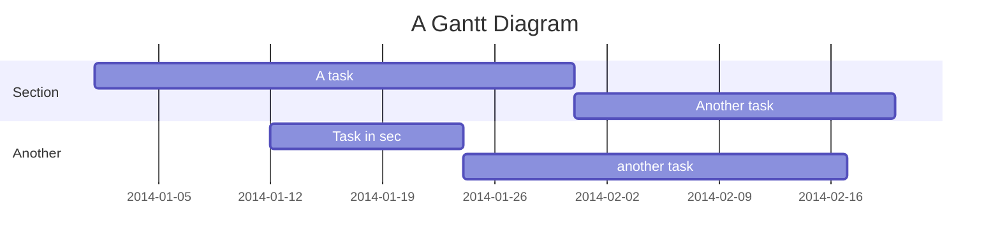
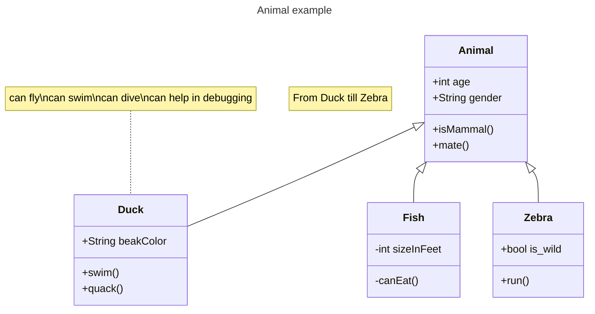

# scikit-shapes
Shape processing in Python.

### Presentation
Scikit-shapes is a python package for the analysis of 2D and 3D shape data. It gathers tools for:

- feature extraction such as curvature
- multiscaling, landmarks setting
- registration with/without landmarks
- population analysis : distance matrices

- task-oriented : basic objects are high-level tasks, such as `Registration` or `Multiscaling`. The algorithmic details as loss function, deformation model, are defined as hyperparameters. (Mettre un diagramme pour registration)

- modular : workflows can be designed following a plug-and-play approach, allowing comparison accross different methods for the same task. In addition, it is possible to implement new modules such as deformation model or loss function and integrate them in existing pipelines.

- efficient : skshapes relies mostly on pyTorch and pyKeOps for computations. It allows to speed-up numerical intensive part of the analysis with parallelization on CPU or GPU.

ajouter bout de code

### Interoperability and modularity

Scikit-shapes relies on other open-source software, our main dependencies are :
- PyTorch and KeOps : skshapes uses pytorch tensors as basic array structure and take benefits of the pytorch ecosystem to let the possibility to accelerate computation on GPU
- PyVista and Vedo : skshapes relies on PyVista for data loading, and on vedo for creating interactive visualization. Skshapes objects are exportable to vedo or pyvista through `.to_vedo()` and `.to_pyvista()` methods
- Jaxtyping and Beartype : arguments of skshapes methods and functions are chacked at runtime using beartype. This leads to clear error messages to diagnosis tensor format error like passing a tensor with the wrong dtype or the wrong number of dimension...

- scikit-learn : when it make sense, we follow the sklearn syntax (`.fit()`, `.transform()`, `.fit_transform()`) for transformers class.
- ...

## Contributing

Diagram examples:

