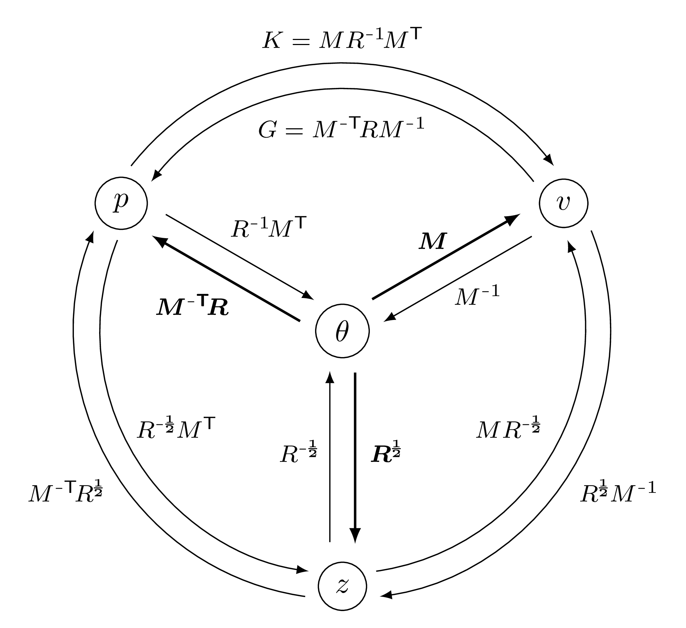

.. _explanation_deformation_linear_general:

Linear models - general case
=============================

We recall the notations of our :ref:`introduction to shape registration<explanation_registration>`:
$\theta$ denotes the vector of P parameters of a deformation model
that maps a source shape $A$ to a deformed shape
$\text{Model}(\,\theta\,;\,A\,)=A_{\theta}$.
Any such deformation is associated to a regularization penalty $\text{Regularization}(\theta)$.

This page describes "linear" deformation models that satisfy the following properties:

1. **Linearity** -- the deformation model is linear in the parameters $\theta$.
   If $X\sim A$ and $X_\theta\sim{}A_\theta$ denote the **vectors of features** of length F
   that represent the source and deformed shapes,
   then there exists a F-by-P matrix $M$ such that:

    .. math::

        X_{\theta} ~=~ X + M \theta~.

  Usually, $X$ is a collection of $xyz$ coordinates and F is equal to three times
  the number of vertices in the source shape $A$.

2. **Quadratic regularization** -- the regularization term is quadratic in the parameters $\theta$.
   There exists a positive (semi-)definite P-by-P matrix $R$ such that:

    .. math::

        \text{Regularization}(\theta) ~=~ \tfrac{1}{2}\| \theta \|^2_{R} ~=~ \tfrac{1}{2} \t{\theta} \T R \theta~.

  This means that the rest pose is associated to the zero vector of parameters $\widehat{\theta}=0$.

Parameters
~~~~~~~~~~

Assuming that there are no additional constraints and that both $M$ and $R$ are invertible,
we can summarize these relationships in the following diagram:

   Links between the four variables that can be used to describe a linear deformation model:
   the vector of parameters $\theta$, the momentum $p$, the displacement $v$
   and the latent code $z$.

We highlight with a bold font the three linear transformations that let
us turn the internal parameter vector $\theta$ into the three standard representations:

.. math::

    \text{(momentum)} \qquad p~&=~ M^{-\mathsf{T}} \T R\, \theta~, \\
    \text{(displacement)} \qquad v~&=~ M \theta~, \\
    \text{(latent code)} \qquad z~&=~ R^{1/2} \theta~.
