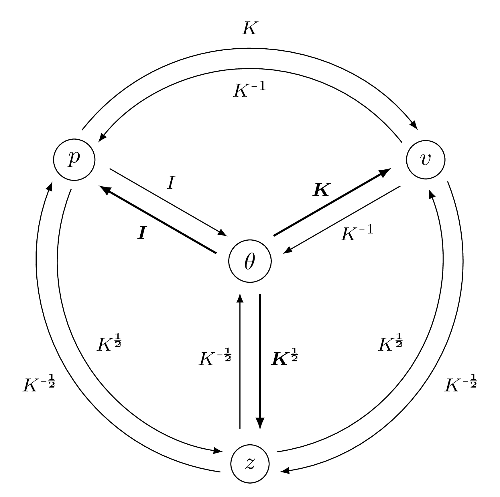

.. _explanation_deformation_linear_momentum:

Linear models - parameterized by momentum
=========================================

Parameters
~~~~~~~~~~

Deformation model
~~~~~~~~~~~~~~~~~

   Links between the four variables that can be used to describe a linear model:
   the parameter $\theta$, the momentum $p$, the displacement $v$
   and the latent code $z$.
