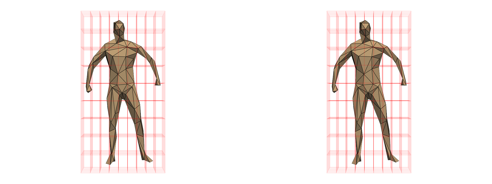

:construction_worker: scikit-shapes development is in pre-alpha stage, the documentation may be incomplete, and the interface could be subject to important changes in a near future.

# Welcome to Scikit-Shapes documentation !

Scikit-shapes is a python library for shape analysis.



### What is a shape ?

Loosely speaking, a shape is something that carry some geometric information. In a computer, a shape can be represented by different means. In scikit-shapes, we aim to support two families of shapes:

- Polygonal structure: a point cloud (ie a collection of points in a 2D or 3D space) and eventually a structure of polygons. In scikit-shapes we are supporting three distinct types of polygonal data : points coulds, wireframe meshes, triangular meshes.
- Images: An image is a grid of pixels.

Typically, the shapes you may want to analyse with scikit-shapes are stored in some file format, for Polygonal Data it can be .ply, ... and for images .png, .nii...

For the moment, only polygonal structures are supported.

### What can I do with scikit-shapes ?

Scikit-shapes offers the possibility to get insight of shape data by various means.

- Single-shape level: compute statistics on a shape, compute features
- Multi-shape level: compute distances between two shapes or distances inside a population of shapes

Our goal is to make the integration of scikit-shapes into machine learning pipelines such as [scikit-learn](https://scikit-learn.org/stable/) seamless. You can think of scikit-shapes as a preprocessing tool that allows you to convert shape data (basically a format that ML tools are not able to read) to a description that can feed various ML/DL procedure. Scikit-shapes is intended to be your choice if you want to:

- find clusters from a collection of 3d data based on morphological features
- compute a distance matrix for a set of poses
- perform landmark-aware alignment

### Where to start ?

First, install scikit-shapes, current preferred solution is through `pip` using sources directly from the main branch on GitHub

```bash
pip install 'skshapes @ git+https://github.com/scikit-shapes/scikit-shapes@main'
```

Then, you can have a look at our [gallery of examples](generated/gallery/).


### Something is missing ? You found a bug ?

Scikit-shapes development is aimed to be community-driven. We warmly are welcome every contributions. Could it be for a new feature, a bug fixing, a typo in the documentation or any kind of feedback, we strongly encourage you to reach us if you think something must be changed.

Have a look at the [contributing](contributing) section to learn more about contribution to scikit-shapes.
